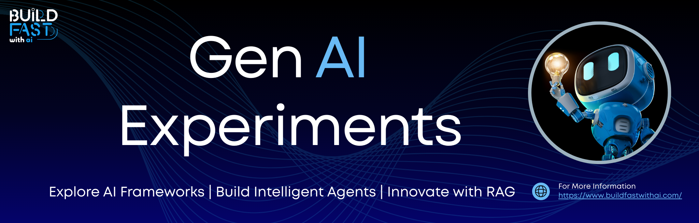

<p align="center">
  <a href="https://www.buildfastwithai.com/">
    
  </a>
</p>

<h1 align="center">🚀 Gen-AI-Experiments</h1>

<p align="center">
  <strong>A curated collection of 130+ production-ready Gen AI apps, agents, installable Agent Skills, MCP servers, and latest-model cookbooks. Built with Claude, GPT-5, Gemini 3, Qwen, GLM, the Model Context Protocol, LangChain, RAG, and Multi-Agent Teams.</strong>
</p>

<p align="center">
  <a href="https://www.linkedin.com/company/build-fast-with-ai">
    
  </a>
  <a href="https://twitter.com/BuildFastWithAI">
    
  </a>
</p>

<p align="center">
  
  
  
  
  
  
  
</p>

---

## 🤔 Why Gen-AI-Experiments?

- 🧩 **Installable Agent Skills** - Reusable `SKILL.md` capabilities for Claude Code, Cowork, and Codex — from landing pages and talking avatars to prompt optimization and QA review
- 🔌 **MCP-Native** - Model Context Protocol servers, clients, and integrations you can plug straight into your agents
- 🧠 **Latest Models, Day One** - Hands-on cookbooks for Claude Opus 4.8, GPT-5.5, Gemini 3, Qwen3.6, GLM-5, Kimi K2.7, DeepSeek V4, and more
- 💡 **Learn by Building** - 130+ production-ready applications and experiments you can run, modify, and learn from
- 🎓 **From Beginner to Advanced** - Structured learning path with starter, intermediate, and advanced projects
- 🌍 **Multi-Language Support** - Projects supporting English, Hindi, and other Indian languages
- 📚 **100+ Libraries Covered** - Tutorials across LangChain, LlamaIndex, CrewAI, AG2, Weaviate, and 90+ more AI/ML libraries

---

## 🧩 Agent Skills

Installable, model-agnostic **Agent Skills** — each a self-contained `SKILL.md` (plus optional `scripts/`, `references/`, and `assets/`) that teaches an agent a repeatable workflow. Drop them into Claude Code, Cowork, or Codex. See the [**Skills index →**](skills/README.md) for full details.

### 🎨 Build & Ship Skills
- **[Landing Page Generator](skills/landing-page-generator/SKILL.md)** - High-converting landing pages as production HTML with PAS/AIDA/BAB copy frameworks, CTA strategy, SEO meta, and conversion/speed audits
- **[Talking Avatar](skills/talking-avatar/SKILL.md)** - Realtime voice-chat apps with a lip-synced character avatar on OpenAI Realtime (Vite/Next.js, BYOK)
- **[Crazy Ecommerce Builder](skills/crazy-ecommerce-builder/SKILL.md)** - Turn a brand brief into an art-directed storefront with original ImageGen product photography

### 🖥️ Frontend Skill Pack — [`skills/frontend-skills/`](skills/frontend-skills/)
- **[Frontend Core](skills/frontend-skills/core/frontend.md)** & **[Tailwind Component Factory](skills/frontend-skills/core/tailwind-component-factory.md)**
- Style systems: **[Glass UI](skills/frontend-skills/styles/glass-ui-system.md)**, **[Neo-Brutalism](skills/frontend-skills/styles/neo-brutalism-web.md)**, **[Minimal Luxury](skills/frontend-skills/styles/minimal-luxury-ui.md)**, **[Bold SaaS](skills/frontend-skills/styles/bold-saas-marketing-ui.md)**, **[Editorial](skills/frontend-skills/styles/editorial-web-layout.md)**, **[Retro-Futurist](skills/frontend-skills/styles/retro-futurist-web.md)**

### 🛠️ Backend Skill Pack — [`skills/backend-skills/`](skills/backend-skills/)
- **[MCP Server Builder](skills/backend-skills/api-auth-data/mcp-server-builder.md)** - Scaffold production MCP servers
- **[Next.js Route Handler](skills/backend-skills/api-auth-data/nextjs-route-handler.md)**, **[MERN Auth Best Practices](skills/backend-skills/api-auth-data/mern-auth-best-practices.md)**, **[Mongoose Schema Architect](skills/backend-skills/api-auth-data/mongoose-schema-architect.md)**

### 📝 Docs & Research Skill Pack — [`skills/docs-writing-research-skills/`](skills/docs-writing-research-skills/)
- **[README Architect](skills/docs-writing-research-skills/readme-architect.md)** · **[Research Synthesizer](skills/docs-writing-research-skills/research-synthesizer.md)** · **[Deck Outline Generator](skills/docs-writing-research-skills/deck-outline-generator.md)**

---

## 🔌 MCP Servers & Tools

The **[Model Context Protocol](https://modelcontextprotocol.io/)** is the open standard for connecting agents to tools and data. This repo ships MCP servers, clients, integrations, and runnable examples under [`mcp/`](mcp/).

- **[Launch MCP 🚀](mcp/servers/launch-mcp/)** - Zero-dependency MCP server that turns any GitHub repo into a complete launch kit: repo analysis, release notes, changelog, blog post, X/Reddit/HN/LinkedIn posts, an interactive HTML demo, and an SVG share card. Tools: `analyze_repo`, `generate_share_card`.
- **[MCP-Use App](apps/mcp-use)** - Reference client showing how to wire MCP tools into an agent loop
- **[MCP Workshop](cookbooks/workshops/MCP_Workshop.ipynb)** - Guided, hands-on notebook for building your first MCP server and client
- **[AG2 + MCP Client](cookbooks/agents/AG2_Building_Multi_Agent_AI_Systems.ipynb)** - Multi-agent GroupChat with tool use over MCP

> Contributing an MCP project? Servers go in [`mcp/servers/`](mcp/servers/), clients in [`mcp/clients/`](mcp/clients/), integrations in [`mcp/integrations/`](mcp/integrations/), and runnable demos in [`mcp/examples/`](mcp/examples/).

---

## 🧠 Latest Model Cookbooks

Day-one testing notebooks for the newest frontier and open models, organized by provider under [`cookbooks/models/`](cookbooks/models/).

### 🟣 Anthropic Claude
- **[Claude Opus 4.8](cookbooks/models/claude/claude-opus-4-8-cookbook.ipynb)** · **[Opus 4.7](cookbooks/models/claude/claude-opus-4-7-cookbook.ipynb)** · **[Opus 4.6 Fast](cookbooks/models/claude/claude-opus-4.6-fast-cookbook.ipynb)**
- **[Sonnet 4.6](cookbooks/models/claude/Claude_Sonnet_4_6_Testing.ipynb)** · **[Sonnet 4.5](cookbooks/models/claude/claude-sonnet-4-5-testing.ipynb)** · **[Haiku 4.5](cookbooks/models/claude/Claude_4_5_Haiku_Testing.ipynb)**

### 🟢 OpenAI
- **[GPT-5.5](cookbooks/models/openai/gpt-5.5-cookbook.ipynb)** · **[GPT-5.4](cookbooks/models/openai/gpt_5_4_cookbook.ipynb)** · **[GPT-5.4 Mini/Nano](cookbooks/models/openai/gpt_5_4_mini_nano_cookbook.ipynb)**
- **[Voice Intelligence](cookbooks/models/openai/advancing-voice-intelligence-cookbook.ipynb)** · **[Structured Outputs](cookbooks/models/openai/openai_structured_outputs.ipynb)** · **[GPT-OSS](cookbooks/models/openai/testing_gpt_oss.ipynb)**

### 🔵 Google Gemini
- **[Gemini 3.5 Flash](cookbooks/models/gemini/gemini-3.5-flash-cookbook.ipynb)** · **[3.1 Pro Preview](cookbooks/models/gemini/google_gemini_3_1_pro_preview_Testing.ipynb)** · **[3.1 Flash Live](cookbooks/models/gemini/gemini-3.1-flash-live-preview-cookbook.ipynb)** · **[3.1 Flash Lite](cookbooks/models/gemini/gemini_3_1_Flash_Lite_guide.ipynb)**
- **[Gemini 3.0 Structured Output](cookbooks/models/gemini/Gemini_3_0_Structured_Output.ipynb)** · **[Embedding 2](cookbooks/models/gemini/gemini_embedding_2_cookbook.ipynb)** · **[Code Execution](cookbooks/models/gemini/gemini_code_execution.ipynb)**

### 🟠 Qwen
- **[Qwen3.6 Max Preview](cookbooks/models/qwen/qwen3.6-max-preview-cookbook.ipynb)** · **[Qwen3.6 Plus](cookbooks/models/qwen/qwen-3.6-plus-cookbook.ipynb)** · **[Qwen3.6 27B](cookbooks/models/qwen/qwen3.6-27b-cookbook.ipynb)** · **[Qwen3 Coder Next](cookbooks/models/qwen/Qwen3_Coder_Next_Testing_Notebook.ipynb)**

### 🔴 Zhipu GLM
- **[GLM-5.2](cookbooks/models/glm/glm-5.2-cookbook.ipynb)** · **[GLM-5.1](cookbooks/models/glm/glm-5.1-cookbook.ipynb)** · **[GLM-5](cookbooks/models/glm/GLM_5_Testing.ipynb)** · **[GLM OCR](cookbooks/models/glm/glm_ocr_cookbook.ipynb)**

### ⚫ More Frontier & Open Models
- **Moonshot Kimi:** **[K2.7 Code](cookbooks/models/kimi/kimi-k2.7-code-cookbook.ipynb)** · **[K2.6](cookbooks/models/kimi/kimi-k2.6-cookbook.ipynb)**
- **DeepSeek:** **[V4 Pro](cookbooks/models/deepseek/deepseek-v4-pro-cookbook.ipynb)** · **[V4 Flash](cookbooks/models/deepseek/deepseek-v4-flash-cookbook.ipynb)**
- **[Grok Code Fast](cookbooks/models/grok/testing_grok_code_fast_1.ipynb)** · **[MiniMax M2](cookbooks/models/minimax/minimax-m2-7-cookbook.ipynb)** · **[Mistral Devstral](cookbooks/models/mistral/Devstral_2512_Testing.ipynb)** · **[Voxtral](cookbooks/models/mistral/mistral_voxtral.ipynb)**
- **Indic & Multilingual:** **[Sarvam 30B/105B](cookbooks/models/sarvam-ai/sarvam_30b_105b_cookbook.ipynb)** · **[Sutra](cookbooks/models/sutra/Getting_Started_with_Sutra.ipynb)** · **[Llama 3 on Indic](cookbooks/models/llama/testing_llama_3_405_bon_indic_languages.ipynb)**

---

## 🛠️ Tools & Tool-Calling

Function-calling, tool orchestration, and model-side tool use — the plumbing that turns a chat model into an agent.

- **[Tool Use Validator](skills/tooling-workflow-skills/tool-use-validator.md)** - Validate function-calling JSON payloads against a schema *before* execution
- **[Prompt Optimizer (CoT)](skills/tooling-workflow-skills/prompt-optimizer-cot.md)** - Rewrite raw tasks into robust Chain-of-Thought prompts with verification
- **[Agent Output Critic](skills/tooling-workflow-skills/agent-output-critic.md)** - Strict QA review for hallucinations, security, and logic flaws before delivery
- **[Git Conventional Commits](skills/tooling-workflow-skills/git-conventional-commits.md)** - Generate Conventional Commits and PR writeups from real diffs
- **[Function Calling with Gemma](apps/function-gemma-tool-calling)** - Local tool-calling with open Gemma models
- **[Gadget Comparator (Gemini URL Context)](apps/gadget-comparator-using-gemini-url-context)** - Grounded product analysis using Gemini's URL-context tool

---

## 📂 Featured AI Projects

### 🌱 Starter Projects
Perfect for beginners getting started with Gen AI:

- **[LangChain Basics](archive/legacy/100-os-libraries/LangChain_Basics_Building_Intelligent_Workflows.ipynb)** - Build intelligent workflows with LangChain
- **[Fine-Tuning with Nebius Token Factory](cookbooks/fine-tuning/Fine_Tuning_LLMs_with_Nebius_TokenFactory.ipynb)** - LoRA fine-tuning for custom LLMs
- **[Getting Started with Pydantic AI](archive/legacy/100-os-libraries/Getting_Started_with_Pydantic_AI.ipynb)** - Type-safe AI development
- **[CrewAI Essentials](archive/legacy/100-os-libraries/CrewAI_Essentials_Quick_Start_Guide.ipynb)** - Quick start guide for multi-agent systems
- **[Hugging Face Transformers](archive/legacy/100-os-libraries/Hugging_Face_Transformers_A_Powerful_Foundation_for_Generative_AI_and_NLP.ipynb)** - Foundation for Gen AI and NLP
- **[LlamaIndex](archive/legacy/100-os-libraries/LlamaIndex_Enhancing_Language_Models_with_Intelligent_Data_Integration.ipynb)** - Intelligent data integration for LLMs
- **[ChromaDB](archive/legacy/100-os-libraries/ChromaDB_Efficient_Vector_Database_for_Embeddings.ipynb)** - Vector database for embeddings

### 🧠 Intermediate Projects
Build more complex AI systems:

- **[AutoGen Multi-Agent System](archive/legacy/100-os-libraries/AutoGen_Building_Collaborative_AI_Agents_in_Python.ipynb)** - Collaborative AI agents
- **[AG2 Multi-Agent AI Systems](cookbooks/agents/AG2_Building_Multi_Agent_AI_Systems.ipynb)** - GroupChat, tool use, MCP client with AG2 (formerly AutoGen)
- **[LangGraph Multi-Agent Swarm](archive/legacy/100-os-libraries/LangGraph_Multi_Agent_Swarm.ipynb)** - Advanced agent orchestration
- **[CSV Agents](cookbooks/agents/CSV_Agents_with_LangChain_&_LlamaIndex.ipynb)** - Data analysis with LangChain & LlamaIndex
- **[AI Customer Support Agent](cookbooks/workshops/AI_Customer_Support_Agent_.ipynb)** - Production-ready support system
- **[RAG Systems](cookbooks/rag/)** - Advanced retrieval-augmented generation

### 🚀 Advanced Projects
Production-grade implementations and cutting-edge research:

- **[Cerebras Inference Comparison](apps/cerebras-inference-comparison)** - High-performance model benchmarking
- **[Deep Stock Research Agent](apps/deep-agent-stock-research)** - Multi-step autonomous financial research
- **[Model Evaluation Cookbooks](cookbooks/models/)** - Comprehensive provider-by-provider model testing
- **[Advanced RAG Architectures](cookbooks/rag/)** - Sophisticated retrieval systems

---

## 🎯 40+ Production-Ready Applications

### 🤖 **Chat & Communication**
- **[Chat with QWEN3 Coder](apps/chat-with-qwen3-coder)** - Advanced coding assistant powered by QWEN
- **[Chat with PDF or Webpage](apps/chat-with-pdf-or-webpage)** - Extract and interact with document content
- **[Chat with GPT-OSS](apps/chat-with-gpt-oss)** - Open-source GPT interface
- **[Sutra V2 Multilingual Chatbot](apps/sutra-v2-multilingual-chatbot)** - Support for Hindi and Indian languages
- **[Vibe Voice TTS](apps/vibe-voice-tts)** - Text-to-speech application

### 🎮 **Games & Entertainment**
- **[Chess Playing Agents](apps/chess_playing_agents_GLM-model)** - AI chess opponents with GLM model
- **[OpenAI Gemini Chess](apps/openai-gemini-chess)** - Multi-model chess game
- **[QWEN Game Generator](apps/qwen-game-generator)** - Automated game creation
- **[World's Fastest Game Generator](apps/world-fastest-game-gen-qwen3coder)** - Rapid game development with QWEN3

### 📚 **Education & Learning**
- **[Multilingual Quiz Generator](apps/educhain-multilanguage-quiz-generator)** - Create quizzes in multiple languages
- **[QnA Generator](apps/educhain-qna-generator)** - Automated question generation
- **[Origami Tutorial Generator](apps/educhain-origami-tutorial-generator)** - Creative step-by-step tutorials
- **[Indian Language Quiz](apps/indian-language-quiz-using-sutra)** - Regional language support
- **[Language Learner](apps/language-learner)** - Interactive language learning platform
- **[Visual Question Generator](apps/visual-question-generator)** - Image-based question creation

### 💼 **Business & Productivity**
- **[AI Business Consultant](apps/ai-business-consultant)** - Strategic business advisor
- **[AI Ad Generator](apps/ai-ad-generator)** - Marketing content creation
- **[Finance AgentOS](apps/finance-agno-agentos)** - Financial analysis and insights
- **[Stock Market Agent](apps/stock-market-agent)** - Real-time market analysis
- **[Deep Stock Research Agent](apps/deep-agent-stock-research)** - Advanced financial research
- **[Marketing Automation](apps/basten-marketing-app)** - Automated marketing campaigns

### 🔍 **Research & Analysis**
- **[Perplexity AI Research Assistant](apps/perplexity-ai-research-assistant)** - AI-powered research automation
- **[Cerebras Search](apps/cerebras-search)** - Ultra-fast search engine
- **[Personalized Search Agent](apps/personalized-search-agent)** - Customized search experience
- **[Similarity Analyzer](apps/similarity-venn-glm4-6)** - Content comparison with Venn diagrams

### 🛠️ **Development Tools**
- **[GitHub README Generator](apps/github-readme-file-generator)** - Auto-generate documentation
- **[Browser Automation](apps/browser-use-streamlit)** - Web automation interface
- **[World's Fastest Website Generator](apps/world-fastest-website-generator)** - Instant web development
- **[Book Writer AI](apps/book-writer)** - Automated content creation
- **[LLM-friendly Web Scraper](apps/llm-friendly-scraping-anycrawl)** - Intelligent web scraping

### 🌐 **Latest AI Integrations**
- **[Gemini 2.0 Multimodal](apps/gemini-2-0-multimodal)** - Google's multimodal AI
- **[News to Blog Automator](apps/news-to-blog-automator)** - Content transformation pipeline
- **[Gadget Comparator](apps/gadget-comparator-using-gemini-url-context)** - Product analysis with Gemini
- **[Chroma Cloud RAG](apps/chroma-cloud-rag)** - Cloud-based retrieval system
- **[MCP Implementation](apps/mcp-use)** - Model Context Protocol
- **[TypeSafe Agno](apps/typesafe-agno)** - Type-safe AI development
- **[NextJS Image Workflow](apps/nano-banana-image-workflow-nextjs)** - Advanced image processing

---

## 🗂️ Repository Structure + Top Cookbooks

Quick directory map to help contributors and learners navigate faster.

### `skills/`
- **Definition:** Installable Agent Skills — each a `SKILL.md` (plus optional `scripts/`, `references/`, `assets/`) that teaches an agent a repeatable workflow.
- **Top Skills:**
  - [Landing Page Generator](skills/landing-page-generator/SKILL.md)
  - [Talking Avatar](skills/talking-avatar/SKILL.md)
  - [Skills Index (README)](skills/README.md)

### `mcp/`
- **Definition:** Model Context Protocol servers, clients, integrations, and runnable examples.
- **Top Resources:**
  - [Launch MCP Server](mcp/servers/launch-mcp/)
  - [MCP Workshop Notebook](cookbooks/workshops/MCP_Workshop.ipynb)

### `agents/`
- **Definition:** Autonomous agent projects that choose their own tools and actions. *(Open for contributions.)*

### `workflows/`
- **Definition:** Predefined, multi-step AI automation pipelines. *(Open for contributions.)*

### `apps/`
- **Definition:** Runnable, user-facing GenAI applications and demos (~60 projects).
- **Top Apps:**
  - [Deep Stock Research Agent](apps/deep-agent-stock-research)
  - [Nano Banana 2 Cookbook](apps/nano-banana-2-cookbook)

### `cookbooks/`
- **Definition:** Educational notebooks — organized into `models/`, `tools/`, `agents/`, `mcp/`, `rag/`, `multimodal/`, `fine-tuning/`, `evaluations/`, and `workshops/`.
- **Top Cookbooks:**
  - [GPT-5.4 Mini/Nano Cookbook](cookbooks/models/openai/gpt_5_4_mini_nano_cookbook.ipynb)
  - [GLM OCR Cookbook](cookbooks/models/glm/glm_ocr_cookbook.ipynb)
  - [Gemini Embedding 2 Cookbook](cookbooks/models/gemini/gemini_embedding_2_cookbook.ipynb)

### `cookbooks/agents/`
- **Definition:** Agent-building notebooks (single-agent and multi-agent) with practical orchestration patterns.
- **Top Cookbooks:**
  - [AgentScope](cookbooks/agents/AgentScope.ipynb)
  - [Kimi K2.5 Agent Swarm](cookbooks/agents/Kimi_K2_5_Agent_Swarm_Cookbook.ipynb)
  - [CSV Agents with LangChain + LlamaIndex](cookbooks/agents/CSV_Agents_with_LangChain_&_LlamaIndex.ipynb)

### `cookbooks/rag/`
- **Definition:** Retrieval-Augmented Generation implementations, multimodal retrieval, and document-grounded QA.
- **Top Cookbooks:**
  - [Claude-Powered RAG from Scratch](cookbooks/rag/How_to_build_Claude_powered_RAG_from_Scratch.ipynb)
  - [RAG Interactive](cookbooks/rag/RAG_Interactive.ipynb)
  - [Vision RAG with Cohere + Gemini](cookbooks/rag/vision_rag_with_cohere_embed_v4__gemini_flash.ipynb)

### `cookbooks/workshops/`
- **Definition:** Hands-on workshop notebooks and guided classroom-style build sessions.
- **Top Cookbooks:**
  - [AI Customer Support Agent Workshop](cookbooks/workshops/AI_Customer_Support_Agent_.ipynb)
  - [MCP Workshop](cookbooks/workshops/MCP_Workshop.ipynb)
  - [Browser Use Workshop](cookbooks/workshops/Browser_Use_Workshop.ipynb)

### `archive/legacy/`
- **Definition:** Older, superseded, or reference content kept for posterity — including the original `100-os-libraries/` (100+ library cookbooks), `experiments/`, and `roadmaps/`.
- **Top Resources:**
  - [100 Open-Source Libraries](archive/legacy/100-os-libraries/)
  - [GenAI Roadmaps](archive/legacy/roadmaps/README.md)

---

## 📈 Trending Notebooks

Curated from recently updated and high-interest notebooks in this repository.

- [Claude Opus 4.8 Cookbook](cookbooks/models/claude/claude-opus-4-8-cookbook.ipynb)
- [GPT-5.5 Cookbook](cookbooks/models/openai/gpt-5.5-cookbook.ipynb)
- [Gemini 3.5 Flash Cookbook](cookbooks/models/gemini/gemini-3.5-flash-cookbook.ipynb)
- [Qwen3.6 Max Preview Cookbook](cookbooks/models/qwen/qwen3.6-max-preview-cookbook.ipynb)
- [GLM OCR Cookbook](cookbooks/models/glm/glm_ocr_cookbook.ipynb)
- [Kimi K2.7 Code Cookbook](cookbooks/models/kimi/kimi-k2.7-code-cookbook.ipynb)
- [DeepSeek V4 Pro Cookbook](cookbooks/models/deepseek/deepseek-v4-pro-cookbook.ipynb)
- [How to Build Claude-Powered RAG from Scratch](cookbooks/rag/How_to_build_Claude_powered_RAG_from_Scratch.ipynb)
- [Kimi K2.5 Agent Swarm Cookbook](cookbooks/agents/Kimi_K2_5_Agent_Swarm_Cookbook.ipynb)
- [MCP Workshop](cookbooks/workshops/MCP_Workshop.ipynb)

---

## 🚀 Getting Started

### Prerequisites
- Python 3.8+
- pip or conda package manager
- Node.js 18+ (for MCP servers and JS/TS apps)
- API keys for services you want to use (OpenAI, Anthropic, Google, etc.)

### Quick Start

1. **Clone the repository**
   ```bash
   git clone https://github.com/buildfastwithai/gen-ai-experiments.git
   cd gen-ai-experiments
   ```

2. **Navigate to your desired project**
   ```bash
   cd apps/your-desired-project
   ```

3. **Install dependencies**
   ```bash
   pip install -r requirements.txt
   ```

4. **Set up API keys**
   ```bash
   # Create a .env file and add your API keys
   echo "OPENAI_API_KEY=your_key_here" > .env
   ```

5. **Run the application**
   ```bash
   streamlit run app.py
   # or
   python app.py
   # or
   jupyter notebook
   ```

6. **Follow project-specific instructions** in each project's `README.md` for detailed setup

### Using the Agent Skills

Agent Skills are model-agnostic. Point your agent (Claude Code, Cowork, or Codex) at any folder under [`skills/`](skills/) and it will read the `SKILL.md` and follow the workflow. See the [Skills index](skills/README.md) for what each one does.

### Installing an MCP Server

```bash
# Example: Launch MCP in Claude Code
/plugin marketplace add buildfastwithai/launch-mcp
/plugin install launch-mcp@buildfastwithai-plugins
```

---

## 🤝 Contributing

We welcome contributions from the community! Here's how you can help:

### How to Contribute

1. **Fork the repository**
2. **Create a feature branch** (`git checkout -b feature/AmazingFeature`)
3. **Commit your changes** (`git commit -m 'Add some AmazingFeature'`)
4. **Push to the branch** (`git push origin feature/AmazingFeature`)
5. **Open a Pull Request**

### Where Things Go

- **Skills** → `skills/<skill-name>/` with a `SKILL.md`
- **MCP** → `mcp/servers/`, `mcp/clients/`, `mcp/integrations/`, or `mcp/examples/`
- **Apps** → `apps/<app-name>/` with a `README.md` and `requirements.txt`
- **Agents** → `agents/<agent-name>/`
- **Workflows** → `workflows/<workflow-name>/`
- **Cookbooks** → `cookbooks/<category>/`
- **Legacy / experimental** → `archive/legacy/`

### Contribution Guidelines

- Follow the existing project structure
- Include a detailed `README.md` for new projects
- Add requirements.txt with all dependencies
- Test your code before submitting
- Write clear commit messages
- Update documentation as needed

### Report Issues

Found a bug or have a feature request? Please create a [GitHub Issue](https://github.com/buildfastwithai/gen-ai-experiments/issues) with:
- Clear description of the issue/feature
- Steps to reproduce (for bugs)
- Expected vs actual behavior
- Screenshots (if applicable)

---

## 🌟 Star History

Show your support by starring this repository!

[](https://star-history.dera.page/#buildfastwithai/gen-ai-experiments&Date)

---

## 📬 Connect With Us

<div align="center">
  <a href="https://buildfastwithai.com" target="_blank">
    
  </a>
  <a href="https://x.com/BuildFastWithAI" target="_blank">
    
  </a>
  <a href="https://www.linkedin.com/company/build-fast-with-ai" target="_blank">
    
  </a>
  <a href="mailto:satvik@buildfastwithai.com">
    
  </a>
</div>

<div align="center">
  <br>
  <p><strong>💡 Have questions or want to collaborate?</strong></p>
  <p>Reach out to us at <a href="mailto:satvik@buildfastwithai.com">satvik@buildfastwithai.com</a></p>
</div>

---

<div align="center">
  <p>Made with ❤️ by <a href="https://buildfastwithai.com">BuildFastWithAI</a></p>
  <p>⭐ Star this repo if you find it helpful!</p>
</div>
