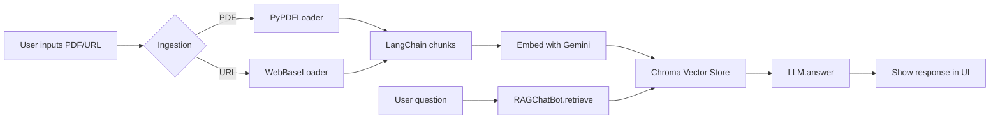

# 📚 chat-pdf-web  
Your AI-powered chatbot for PDFs and web pages – built with **Streamlit**, **LangChain**, and **Gemini 2.5 Pro**.

[](https://python.org)
[](https://streamlit.io)
[](https://langchain.dev)
[](https://ai.google.dev)
[](LICENSE)
[](CONTRIBUTING.md)

---
Live Link 👉  https://chat-with-pdf-or-webpage.onrender.com/
## ✨ Features

| Feature | Description |
|---|---|
| 🗂️ **PDF Chat** | Drag-and-drop any PDF and start chatting instantly. |
| 🌐 **Website Chat** | Paste any URL to browse & chat with its content. |
| 🧠 **Gemini 2.5 Pro** | Powered by Google’s newest reasoning model. |
| 🔍 **Vector Store** | Fast & persistent embeddings with **Chroma**. |
| 🖼️ **Streamlit UI** | Responsive sidebar and chat interface. |
| 🔁 **State-ful** | Retains chat history and vectorstore across sessions. |

---

## 🚀 Quick Start

### 1. Clone
```bash
git clone https://github.com/<your-org>/chat-pdf-web.git
cd chat-pdf-web
```

### 2. Install
```bash
pip install -r requirements.txt
# or
pip install .
```

> Python ≥ 3.10 recommended.

### 3. Launch
```bash
streamlit run main.py
```
A browser tab will open at `http://localhost:8501`.

### 4. Configure
In the sidebar:
1. Enter your **Gemini API key**.
2. Upload a PDF or enter a website URL.
3. Click **Ingest** and start chatting!

---

## 📖 Usage

| Step | UI/CLI |
|---|---|
| 1. **Provide key** | Sidebar → “Enter your Gemini API key…” |
| 2. **Upload PDF** | “Upload PDF” file picker. |
| 3. **Add website** | “Enter website URL” input. |
| 4. **Ingest** | Click **Ingest** (downloads, chunk, embed). |
| 5. **Chat** | Type questions in the chat box. |
| 6. **Clear Everything** | Click “End Chat” to reset.

---

## 🛠 Tech Stack

| Layer | Stack |
|---|---|
| UI | Streamlit, `streamlit-extras` |
| LLM | Google `gemini-2.5-pro`, `google-generativeai` |
| Embeddings | `gemini-embedding-001` |
| Orchestration | LangChain |
| Vector DB | ChromaDB (persisted) |
| PDF parsing | **PyPDFLoader** via `pypdf` |
| Web scraping | `WebBaseLoader`, BeautifulSoup4 |
| Config | `pyproject.toml` (modern PEP621) |

---

## 📁 Data Flow



---

## ⚙️ Environment Variables (optional)

| Var | Default | Purpose |
|---|---|---|
| `GOOGLE_API_KEY` | — | Falls back to sidebar input. |
| `CHROMA_PERSIST_DIR` | `./chroma_db` | Vectorstore path. |
| `CHUNK_SIZE` | 1000 | Text-split parameter. |
| `CHUNK_OVERLAP` | 200 | Text-split parameter. |

---

## 🤝 Contributing

We love community contributions!  
Please see [CONTRIBUTING.md](CONTRIBUTING.md) for guidelines.

### TL;DR
1. Fork.
2. `pre-commit install`.
3. Commit & push on a feature branch.
4. Create a PR 🚀

---

## 🔗 References & Credits

* Streamlit – [docs.streamlit.io](https://docs.streamlit.io)
* LangChain – [langchain.dev](https://langchain.dev)
* Google AI – [ai.google.dev](https://ai.google.dev)

---

## 📄 License

MIT © 2024 [Build Fast with AI](https://buildfastwithai.com) and contributors.
