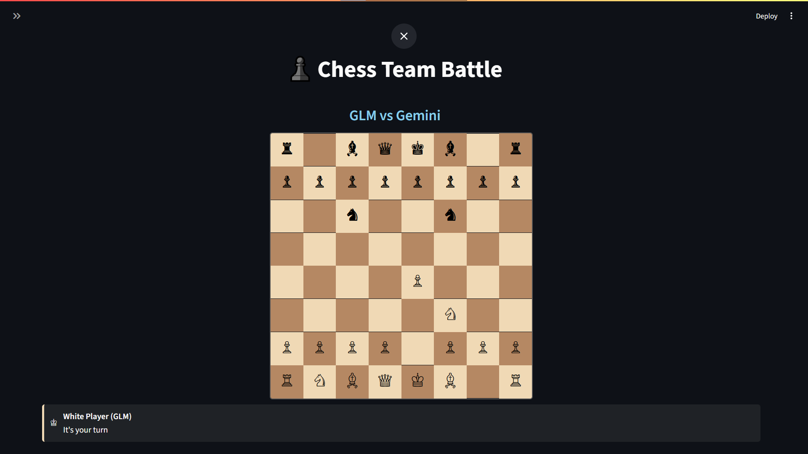

# ♟️ Chess Team Battle

Watch AI agents battle it out in chess with specialized roles! This application features a team of AI agents playing chess against each other, with different models taking on specific roles like White Player, Black Player, and Game Master.

**🎯 Watch different AI models compete in chess with real-time move analysis and commentary!**

---

## 🖼️ Screenshots

### Main Game Interface


*The main chess game interface showing AI agents playing with real-time board updates, game controls, and model selection.*

### Move History Panel


*Detailed move history showing each move with descriptions, player information, and game progression.*

---

## 🚀 Features

- **🤖 Multi-Agent Chess**: Different AI models play as White, Black, and Game Master
- **🧠 Specialized Roles**: Each agent has a specific role and strategy
- **📊 Real-time Analysis**: Game Master provides position analysis and commentary
- **🎮 Interactive UI**: Beautiful Streamlit interface with live board updates
- **⏸️ Game Controls**: Start, pause, resume, and restart games
- **📝 Move History**: Complete move history with descriptions
- **🔍 Legal Move Validation**: Powered by python-chess for accurate gameplay
- **🎨 Modern Design**: Dark mode support with custom CSS styling

---

## 🏗️ Architecture

The application uses a **team-based architecture** with three specialized AI agents:

### 🤖 Agent Roles

1. **♔ White Player Agent**: Strategist for white pieces
   - Analyzes legal moves and chooses the best strategy
   - Considers piece development, center control, and king safety
   - Responds with moves in UCI notation (e.g., 'e2e4')

2. **♚ Black Player Agent**: Strategist for black pieces
   - Same strategic analysis but for black pieces
   - Competes against the white player agent

3. **🧠 Game Master Agent**: Coordinator and analyst
   - Coordinates between player agents
   - Provides position analysis and commentary
   - Evaluates game state and determines winners

### 🔧 Technical Stack

- **Frontend**: Streamlit with custom CSS
- **AI Framework**: Agno (multi-agent orchestration)
- **Chess Engine**: python-chess for move validation
- **AI Models**: OpenRouter integration (GPT-4, GLM, Gemini)
- **Styling**: Custom dark mode CSS with chess-themed design

---

## 🛠️ Installation & Setup

### Prerequisites

- Python 3.8+
- OpenRouter API key

### Installation

1. **Clone the repository:**
   ```bash
   git clone <repository-url>
   cd chess
   ```

2. **Install dependencies:**
   ```bash
   pip install -r requirements.txt
   ```

3. **Get your OpenRouter API key:**
   - Visit [OpenRouter](https://openrouter.ai/)
   - Create an account and get your API key

4. **Run the application:**
   ```bash
   streamlit run app.py
   ```

---

## 🎮 How to Use

1. **Enter your OpenRouter API key** in the sidebar
2. **Select AI models** for each role:
   - **White Player**: Choose from GPT-4, GLM, or Gemini
   - **Black Player**: Choose from GPT-4, GLM, or Gemini  
   - **Game Master**: Choose from GPT-4, GLM, or Gemini
3. **Start the game** by clicking "▶️ Start Game"
4. **Watch the AI agents play** in real-time
5. **Use game controls**:
   - ⏸️ **Pause/Resume**: Control game flow
   - 🔄 **New Game**: Start a fresh game
6. **Follow the action** with move history and analysis

---

## 🧠 Supported AI Models

The application supports multiple AI models via OpenRouter:

- **GPT-4** (`openai/gpt-4o`): OpenAI's latest model
- **GLM** (`z-ai/glm-4.5-air`): Zhipu AI's advanced model
- **Gemini** (`google/gemini-pro-1.5`): Google's powerful model

### Model Selection Strategy

- **Default Setup**: GLM (White) vs Gemini (Black) with GLM (Game Master)
- **Customizable**: Mix and match different models for varied gameplay
- **Performance**: Different models may show different playing styles and strategies

---

## 🎯 Game Features

### Move Validation
- **python-chess integration** ensures all moves are legal
- **UCI notation** for precise move representation
- **SAN notation** for human-readable moves
- **Automatic promotion** and special move handling

### Game Analysis
- **Position evaluation** after each move
- **Strategic commentary** from the Game Master
- **Advantage assessment** (white/black/equal)
- **Game state tracking** (check, checkmate, draw)

### User Interface
- **Real-time board updates** with Unicode chess pieces
- **Move history** with detailed descriptions
- **Agent status indicators** showing current player
- **Thinking animations** during AI deliberation
- **Game result announcements** with win/loss/draw reasons

---

## 🔧 Configuration

### Environment Variables
```bash
OPENROUTER_API_KEY=your_api_key_here
```

### Model Configuration
You can customize the default models in `agents.py`:
```python
def get_chess_team(
    white_model: str = "GLM:z-ai/glm-4.5-air",
    black_model: str = "google:google/gemini-pro-1.5", 
    master_model: str = "openai:openai/gpt-4o",
    debug_mode: bool = True,
) -> Team:
```

---

## 📁 Project Structure

```
chess/
├── app.py              # Main Streamlit application
├── agents.py           # AI agent definitions and team setup
├── utils.py            # Chess board utilities and UI components
├── requirements.txt    # Python dependencies
└── README.md          # This file
```

### Key Components

- **`app.py`**: Main application logic, UI, and game flow
- **`agents.py`**: AI agent definitions using Agno framework
- **`utils.py`**: Chess board implementation and UI utilities
- **`requirements.txt`**: All necessary Python packages

---

## 🎨 Customization

### Adding New AI Models
1. Add the model to `get_model_for_provider()` in `agents.py`
2. Update the model options in `app.py`
3. Test with different model combinations

### UI Customization
- Modify `CUSTOM_CSS` in `utils.py` for styling changes
- Update chess piece Unicode characters
- Customize color schemes and animations

### Game Rules
- All standard chess rules are enforced by python-chess
- Special moves (castling, en passant, promotion) are handled automatically
- Game termination conditions are properly detected

---

## 🤝 Contributing

Contributions are welcome! Here are some areas for improvement:

- **New AI Models**: Add support for additional AI providers
- **Enhanced Analysis**: Improve position evaluation and commentary
- **UI Improvements**: Better visualizations and animations
- **Game Variants**: Support for different chess variants
- **Performance**: Optimize agent response times

---

## 🙏 Credits

- **Chess Engine**: [python-chess](https://python-chess.readthedocs.io/)
- **AI Framework**: [Agno](https://github.com/agno-ai/agno)
- **Web Framework**: [Streamlit](https://streamlit.io/)
- **AI Models**: [OpenRouter](https://openrouter.ai/) integration
- **Chess Pieces**: Unicode chess symbols

---

## 📄 License

MIT License

Copyright (c) 2024 buildfastwithai

Permission is hereby granted, free of charge, to any person obtaining a copy
of this software and associated documentation files (the "Software"), to deal
in the Software without restriction, including without limitation the rights
to use, copy, modify, merge, publish, distribute, sublicense, and/or sell
copies of the Software, and to permit persons to whom the Software is
furnished to do so, subject to the following conditions:

The above copyright notice and this permission notice shall be included in all
copies or substantial portions of the Software.

THE SOFTWARE IS PROVIDED "AS IS", WITHOUT WARRANTY OF ANY KIND, EXPRESS OR
IMPLIED, INCLUDING BUT NOT LIMITED TO THE WARRANTIES OF MERCHANTABILITY,
FITNESS FOR A PARTICULAR PURPOSE AND NONINFRINGEMENT. IN NO EVENT SHALL THE
AUTHORS OR COPYRIGHT HOLDERS BE LIABLE FOR ANY CLAIM, DAMAGES OR OTHER
LIABILITY, WHETHER IN AN ACTION OF CONTRACT, TORT OR OTHERWISE, ARISING FROM,
OUT OF OR IN CONNECTION WITH THE SOFTWARE OR THE USE OR OTHER DEALINGS IN THE
SOFTWARE. 